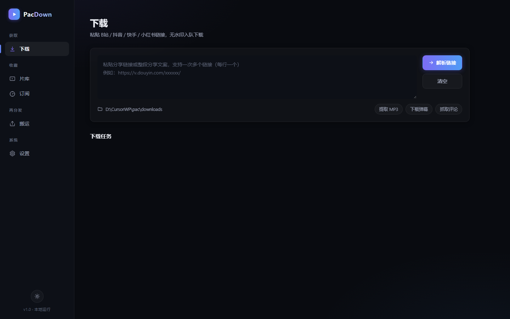

# PacDown · 全平台视频下载工具

本地运行的 Web 应用：粘贴链接 → 自动识别平台 → 无水印下载 → 元数据保存，支持订阅博主自动追更、合集批量下载与视频/图片后处理工具箱。



## 支持平台

| 平台 | 说明 |
|---|---|
| 哔哩哔哩 | BV / av / b23.tv 短链；SESSDATA 解锁 1080P+；弹幕 XML、热评抓取；**分P/合集批量** |
| 抖音 | 分享短链；无水印直下；视频 + 图集；**合集批量**；需配置 Cookie（2025 起平台关闭免登录解析） |
| 快手 | 无水印直链 |
| 小红书 | 视频 + 图集（需配置 Cookie） |
| 直链 / m3u8 | 任意 http(s) 资源直链（网盘直链、静态文件），断点续传；m3u8 流合并下载 |
| 通用 | yt-dlp 引擎兜底：YouTube、西瓜、微博等上千站点 |

## 功能

- **批量下载**：整段分享文案粘贴，自动提取全部链接；B站分P/合集、抖音合集、博主主页一键批量入队，最多 50 个并行队列
- **工具箱**：视频转码（H.264/H.265/VP9）、压缩、剪辑、GIF、文字水印、截帧；图片转换/压缩、拼接长图、图集打包 ZIP；支持本地上传素材
- **文件管理**：按 `平台/作者/日期_标题` 自动分类（命名模板可自定义），封面、弹幕、MP3、图集一并保存
- **片库管理**：标签、收藏、网格/列表视图、批量删除/导出 CSV
- **数据保存**：SQLite + 每视频 sidecar JSON 双份元数据，可导出 CSV
- **在线预览**：视频播放（支持拖进度条）、图集灯箱、MP3 试听
- **订阅追更**：B站 / 抖音 / 小红书 / 快手博主定时检查新视频自动下载，支持每订阅独立后处理选项
- **通知中心**：订阅更新与任务失败实时通知（铃铛 + 浏览器桌面通知）
- **界面**：暗色/明亮双主题，玻璃拟态设计，全中文

## 快速开始

```bash
pip install -r requirements.txt
python run.py
# 浏览器打开 http://127.0.0.1:8300
```

Windows 可直接双击 `start.bat`；NAS/服务器用 `docker compose up -d`。

## 文档

- [技术架构文档](docs/技术架构文档.md)
- [使用手册](docs/使用手册.md)（含各平台 Cookie 配置教程、网盘直链用法与 FAQ）
- [开发文档](docs/开发文档.md)（新增平台解析器指南）

## 说明

- MP3 提取与视频类工具需要本机安装 ffmpeg（Docker 版已内置）
- 抖音/小红书解析需配置浏览器 Cookie，方法见使用手册第 6 节
- 网盘文件下载：用浏览器直链插件获取真实地址后粘贴下载，详见使用手册
- 仅供个人学习与备份已授权内容，请勿用于批量爬取或二次分发
